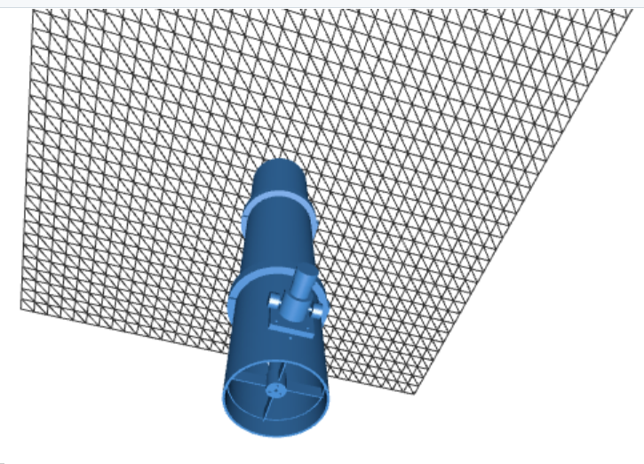

# 高倍率天文望远镜
物镜、目镜、反射镜等精密光学器件从网上采购, 其它材料依靠3D打印机进行打印

- [折射式天文望远镜设计指南](design.md)
- [牛顿反射式天文望远镜设计与3D打印模型](newtonian_design.md) (114mm口径方案)
- [伽利略式天文望远镜设计方案](galilean_design.md) (50mm口径方案)
- [摄影级（相机用）天文望远镜原理与经典设计](astrophotography_telescope.md)
